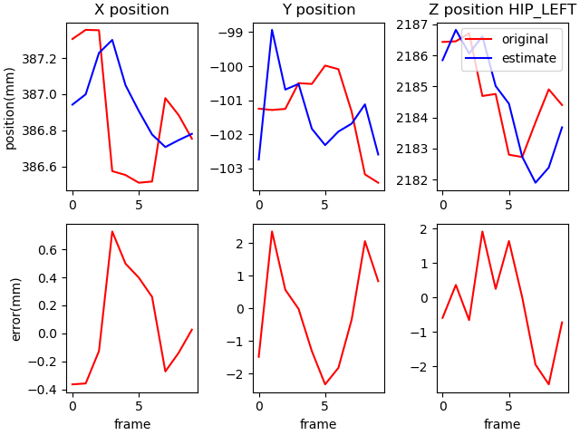
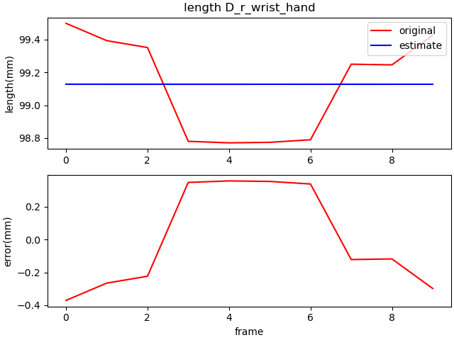

# PyUKF Kinect Body Tracking

- This project aims to compenate **skeleton data** using **Unscented Kalman Filter(UKF)**.
- Skeleton data is given 32 joint information from **Kinect v2 camera **and **Azure Kinect Body Tracking SDK (v1.0.1)**.
- **pykalman** library is used for UKF
- **python v3.7**


# Project Guide

## install 

1. install python 3
2. install python packages
All of these and `pykalman` can be install using `easy_install`
```bash
easy_install numpy matplotlib scipy wheel pykalman
```

## How to use
```bash
git clone https://github.com/fbdp1202/pyukf_kinect_body_tracking.git
cd pyukf_kinect_body_tracking
python test.py
```

### Test UKF and generate '.csv' files

- `test_skeleton_filter(person_name, pose, test_num)`
- The skeleton data folder looks like this:
  `./data/skeleton_data/pereson_name/pose/`
- Skeleton data form named `sk_timestamp_txt` and include one person data
- save original and filtered data on `./result/person_name/pose/model_name/` each `ground_data.csv` and `estimate_data.csv`
- **Example code** `(persone_name="jiwon", pose="crossing_arms_30sec", model="ukf")`

```python
test_skeleton_filter("jiwon", "crossing_arms_30sec", test_num=10)
```

### Display Skeleton data

- `test_skeleton_draw(person_name, pose, plot_3D)`
- `Load .csv file` saved above to provide `3D plot`, `(x, y, z) point plot` and `joint length plot` with pyplot.
- Folder where the `point plot images` and `joint length plot images` are saved is as follows:
  `./result/person_name/pose/mode_name/` each `point` and `length`  folder
- point plot
  
- length plot
  
- 3D plot result:


```python
	test_skeleton_draw("jiwon", "crossing_arms_30sec", plot_3D=True)
```


## Future Work

- Finding better `covariance values` for UKF
- Displaying the `combined depth image and filtered data`
- Make `3D plot into .mkv file` for easy viewing
- Applying various filters such as `Kalman Filter`, `Tobit kalman Filter`, `Particle Filter`...
- Eliminate runtime error in UKF by applying `rSVD` rather than `cholesky decomposition`
- Linking with `real-time applications`
- Creating algorithms to cope with `multi-skeleton data`
- Automatic `skeleton data classification`
- Creating `various disease diagnostic` applications


# LICENSE

[MIT](LICENSE.md)

# Reference

[Kinematic Data Filtering with Unscented Kalman Filter](https://fenix.tecnico.ulisboa.pt/downloadFile/1689244997258111/mgoulao_paper.pdf)

