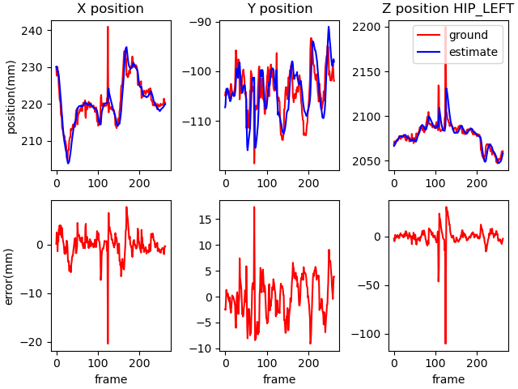
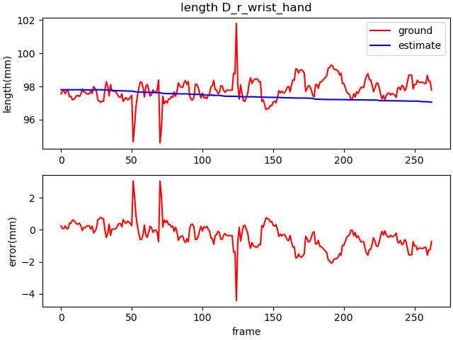

# PyUKF Kinect Body Tracking

- This project aims to compenate **skeleton data** using **Unscented Kalman Filter(UKF)**.
- Skeleton data is given 32 joint information from **Kinect v2 camera** and **Azure Kinect Body Tracking SDK (v1.0.1)**.
- **pykalman** library is used for UKF
- **python v3.7**


# Project Guide

## install 

1. install python 3
2. install python packages


All of these and `pykalman` can be install using `easy_install`
```bash
easy_install numpy matplotlib scipy wheel pykalman argparse
```


3. Download `imagemagick` to generate `.gif` file
[Download site](http://www.imagemagick.org/script/download.php): `ImageMagick-7.0.10-10-Q16-x64-dll.exe` install


## How to use

### Simple Test
```bash
git clone https://github.com/fbdp1202/pyukf_kinect_body_tracking.git
cd pyukf_kinect_body_tracking
python test.py jiwon crossing_arms_30sec
```

### Optional mode
```bash
$.../pyukf_kinect_body_tracking>python test.py -h
usage: test.py [-h] [--filter {on,off}] [--model {ukf,kf}] [--plot {on,off}]
               [--num NUM] [--cbr_num CBR_NUM]
               First_string Second_string

positional arguments:
  First_string       What is your person name?
  Second_string      What is your pose? "*" is all pose

optional arguments:
  -h, --help         show this help message and exit
  --filter {on,off}  Do you want to plot?
  --model {ukf,kf}   which type of filter?
  --plot {on,off}    Do you want to plot?
  --num NUM          How many tests do you want?
  --cbr_num CBR_NUM  How many calibration tests do you want?
```

```bash
# Adjust the number of tests
python test.py jiwon crossing_arms_30sec --num 10

# off filter mode
python test.py jiwon crossing_arms_30sec --filter off

# off plot mode
python test.py jiwon crossing_arms_30sec --plot off

# one person, all pose test
python test.py jiwon *

# choose model 
# not yet implement kalman filter(kf) mode
# python test.py jiwon crossing_arms_30sec --model kf
```

### Test UKF and generate '.csv' files

- `test_skeleton_filter(person_name, pose, test_num)`
- The skeleton data folder looks like this:


  `./data/skeleton_data/pereson_name/pose/`
- Skeleton data form named `sk_timestamp_txt` and include one person data
- save original and filtered data on `./result/person_name/pose/model_name/` each `original_data.csv` and `estimate_data.csv`
- **Example code** `(persone_name="jiwon", pose_mode="crossing_arms_30sec", model="ukf")`

```python
test_skeleton_filter("jiwon", "crossing_arms_30sec", test_num=10, cbr_num=10, "ukf")
```

### Display Skeleton data

- `test_skeleton_draw(person_name, pose, plot_3D)`
- `Load .csv file` saved above to provide `3D plot`, `(x, y, z) point plot` and `joint length plot` with pyplot.
- Folder where the `point plot images` and `joint length plot images` are saved is as follows:


  `./result/person_name/pose/mode_name/` each `point` and `length`  folder
- point plot:
  
  


- length plot:
  
  


- 3D plot result:


```python
	test_skeleton_draw("jiwon", "crossing_arms_30sec", "ukf")
```


## Future Work

- Finding better `covariance values` for UKF
- Displaying the `combined depth image and filtered data`
- Applying various filters such as `Kalman Filter`, `Tobit kalman Filter`, `Particle Filter`...
- Eliminate runtime error in UKF by applying `rSVD` rather than `cholesky decomposition`
- Linking with `real-time applications`
- Creating algorithms to cope with `multi-skeleton data`
- Automatic `skeleton data classification`
- Creating `various disease diagnostic` applications


# LICENSE

[MIT](LICENSE.md)

# Reference

[Kinematic Data Filtering with Unscented Kalman Filter](https://fenix.tecnico.ulisboa.pt/downloadFile/1689244997258111/mgoulao_paper.pdf)

